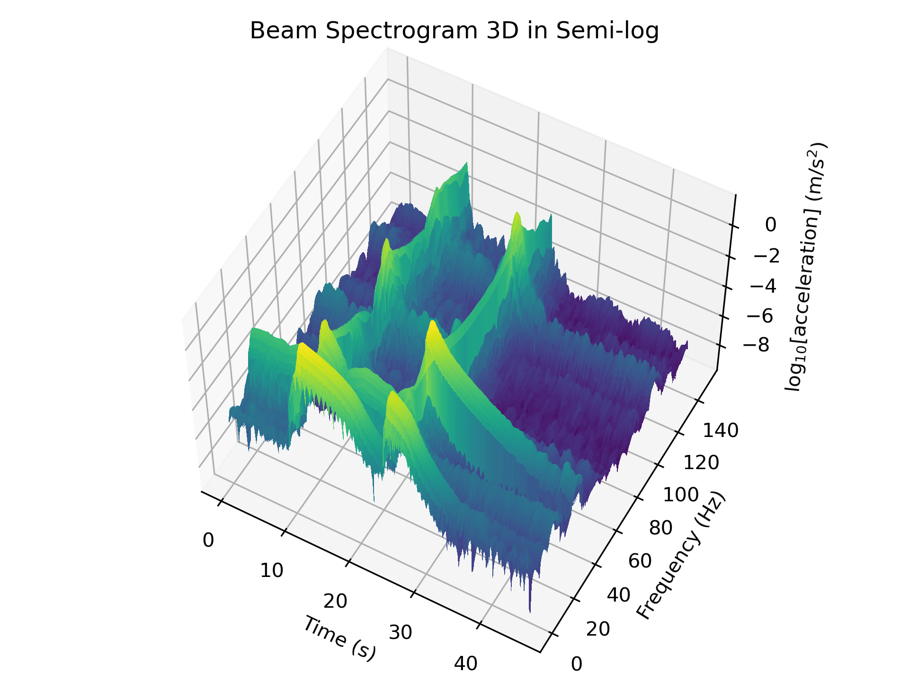

# Vibtration data for cantilever beam 

## Data

This repo contains vibration data for a cantilever beam as shown below. A video of the system is also posted at https://www.youtube.com/watch?v=50uMt-VIjR8

https://github.com/austindowney/dataset-free-vibration-of-cantilever-beam/assets/15316737/d8b73d6f-0344-40fb-b1b2-a755b1d5f9b2

The time-frequency response of the beam is shown in the spectrogram of the system below. Not the upward shift in frequency for all three modes after the mass drop.

3D Spectrogram of the beam in log base 10 scale. An interactive 3D plot of the figure can be found in the data folder with the name "3D_plot.html".

## License

This work is licensed under a
[Creative Commons Attribution-ShareAlike 4.0 International License][cc-by-sa].

